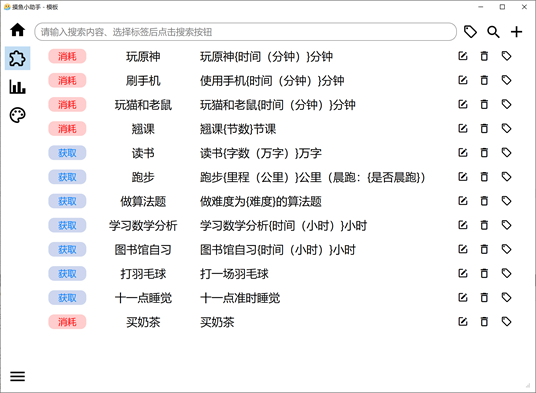
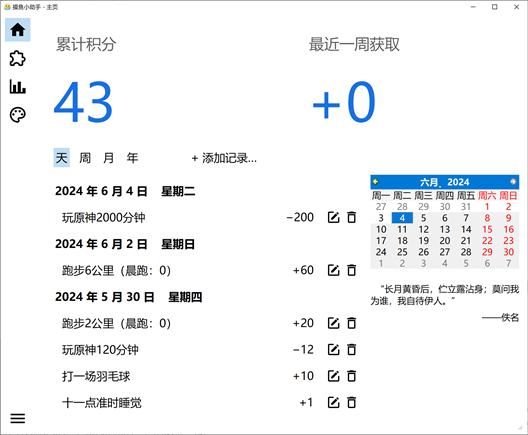
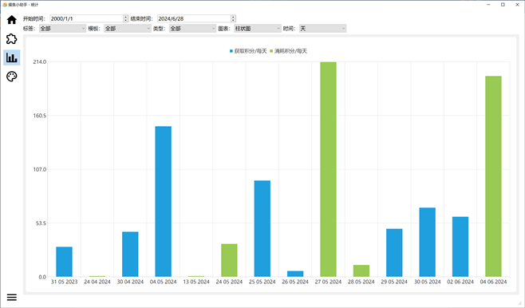
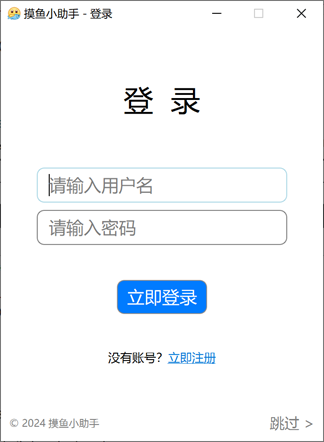
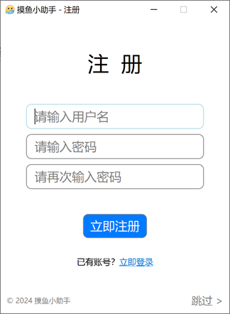
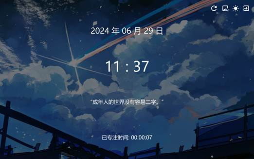
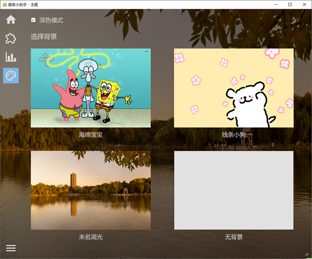

## 摸鱼小助手

本项目是北京大学程序设计实习课程 Qt 大作业。

组员：张远洋、王之略、刘曜玮。

查看 [作业报告](作业报告、演示视频/44-作业报告.pdf)、[演示视频](作业报告、演示视频/44-演示.mp4)。

### 项目背景

在每天的学习生活中，我们希望自己能保持专注，避免“摸鱼”。但往往事与愿违，有时我们会不自觉地想要“摸鱼”，导致很多工作无法按时完成。我们便希望开发出一个软件，帮助大家减少“摸鱼”的时间，变得更自律。

### 项目功能概述

我们软件的主体部分是一个积分系统。每当用户进行了专注学习或其它各种自律的行为，可以在软件中进行记录，获取相应的积分；而当用户进行了“摸鱼”等行为，也可以在软件中进行记录，扣除相应的积分。通过这样的积分系统，用户可以定量化地了解自己最近的专注情况，且由于获取积分的成就感和失去积分的损失厌恶心理，可以变得更加自律，提升学习、工作的效率。

### 具体功能设计

> 注：以下截图中的数据来自我们的演示账号（用户名：演示账号；密码：123456），可登录进行查看。使用该账号也可更方便地测试统计、数据同步等功能。

#### 模版

用户可预先设定若干事项作为模版，添加记录时可通过模板快速添加。模板中支持设定任意多个变量，并可通过设定的公式从变量计算出最终结果。

例：模板：使用手机 $\{x\}$ 分钟。扣除 $\max(0, x-180)$ “积分”。

#### 记录

以时间线的形式展示所有记录，可按天/周/月等不同的详细程度展示。可在任意一天添加、删除、修改记录。

#### 数据的统计

可统计特定时间范围内、满足特定条件的记录情况，统计“积分”总的获取与消耗情况。 通过漂亮、多样的图表呈现。

#### 账号系统与数据同步

用户可在不同的设备上登录账号，相同账号的模版、记录、设置等内容均可通过云端自动同步。

 

#### 专注模式

如果用户认为自己用电脑摸鱼了太长时间，可以开启专注模式。专注模式开启期间其窗口将保持置顶，无法通过指定方式以外的方式退出，无法使用任何键盘快捷键。如果切换到其它桌面，还会自动提示返回专注模式。专注模式中还支持开启深色模式、或者切换背景图片，以提供更好的体验。专注模式分为普通模式和倒计时模式，倒计时模式下用户可提前设定期望的专注时间，未到指定时间将无法退出。

#### 主题

软件为用户提供了不同的主题。用户可根据自身喜好选择背景图片、开启深色模式等。

